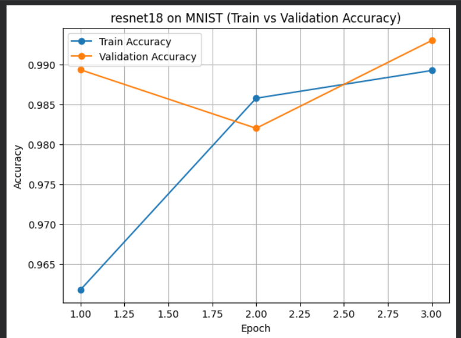
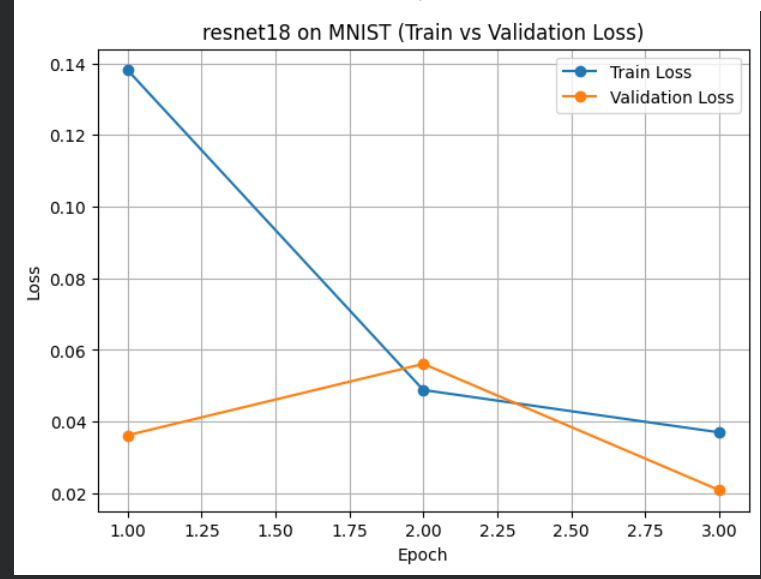

# MlOps-kartik-m25CSA025
# DL-Ops Lab Assignment 1

## Overview
This repository contains experiments performed as part of **DL-Ops Lab Assignment 1**.  
The goal is to study the impact of **batch size, optimizer, learning rate, model architecture, and compute platform (CPU vs GPU)** on image classification performance.

Experiments are conducted on:
- **MNIST**
- **FashionMNIST**

using:
- **Deep Learning models** (ResNet-18, ResNet-50)
- **Classical ML models** (SVM with Polynomial and RBF kernels)

---

## Deep Learning Experiments

### Hyperparameters Explored
- Batch sizes: `16`, `32`
- Optimizers: `SGD`, `Adam`
- Learning rates: `0.001`, `0.0001`
- models : `resnet18` , `resnet50`

---

## Results: MNIST

| Batch Size | Optimizer | Learning Rate | ResNet-18 (%) | ResNet-50 (%) |
|-----------|----------|---------------|--------------|---------------|
| 16 | SGD | 0.001 | 98.97 | 98.86 |
| 16 | SGD | 0.0001 | 96.37 | 94.77 |
| 16 | Adam | 0.001 | 98.87 | 98.71 |
| 16 | Adam | 0.0001 | **99.17** | 98.36 |
| 32 | SGD | 0.001 | 98.38 | 98.36 |
| 32 | Adam | 0.0001 | 99.08 | 98.81 |

---

## Results: FashionMNIST

| Batch Size | Optimizer | Learning Rate | ResNet-18 (%) | ResNet-50 (%) |
|-----------|----------|---------------|--------------|---------------|
| 16 | SGD | 0.001 | 90.42 | 89.64 |
| 16 | SGD | 0.0001 | 83.36 | 76.22 (3 ep) / 86.39 (8 ep) |
| 16 | Adam | 0.001 | 90.59 | 89.22 |
| 16 | Adam | 0.0001 | **91.62** | **90.20** |
| 32 | SGD | 0.001 | 89.27 | 87.89 |
| 32 | Adam | 0.0001 | 91.04 | 89.41 |

---

## Training & Validation Curves

The following graphs correspond to the **best configuration**:
- Batch size = `16`
- Optimizer = `Adam`
- Learning rate = `0.0001`
- Model = `ResNet-18`
- Dataset = `MNIST`

### Training vs Validation Accuracy

### Training vs Validation Loss

---

## SVM Classification Results

| Dataset | Kernel | Accuracy (%) | Training Time (ms) |
|-------|--------|--------------|--------------------|
| MNIST | Polynomial | 91.70 | 4578 |
| MNIST | RBF | **93.15** | 4172 |
| FashionMNIST | Polynomial | 81.55 | 3928 |
| FashionMNIST | RBF | **85.15** | 3791 |

---
### CPU vs GPU Performance Comparison

| Compute | Batch Size | Optimizer | Learning Rate | ResNet-18 Accuracy (%) | ResNet-32 Accuracy (Optional) (%) | ResNet-50 Accuracy (%) | ResNet-18 Train Time (ms) | ResNet-32 Train Time (Optional) (ms) | ResNet-50 Train Time (ms) | ResNet-18 FLOPs | ResNet-32 FLOPs (Optional) | ResNet-50 FLOPs |
|--------|-----------|-----------|---------------|-----------------------|----------------------------------|-----------------------|---------------------------|--------------------------------------|---------------------------|---------------|----------------------------|---------------|
| CPU | 16 | SGD | 0.001 | 85.95 | NA | 80.62 | 54075 | NA | 130139 | 1.824 | NA | 4.132 |
| CPU | 16 | Adam | 0.001 | 85.85 | NA | 80.95 | 56384 | NA | 131496 | 1.824 | NA | 4.132 |
| GPU | 16 | SGD | 0.001 | 90.42 | NA | 89.64 | 40988 | NA | 76061 | 1.824 | NA | 4.132 |
| GPU | 16 | Adam | 0.001 | 90.59 | NA | 89.22 | 44224 | NA | 81390 | 1.824 | NA | 4.132 |

---

## Links
- 📓 Colab Notebook: [Open in Colab](https://colab.research.google.com/drive/14PQwbYVtsiNgUgT1_LfDSVID2RHZJTuJ?usp=sharing)
  
